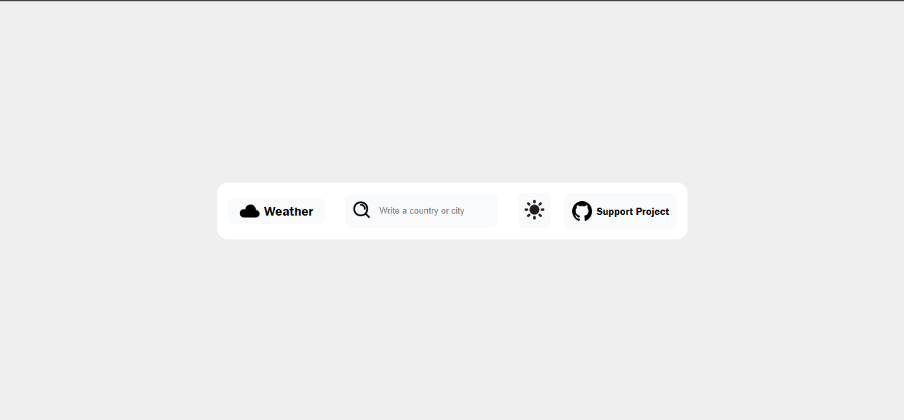
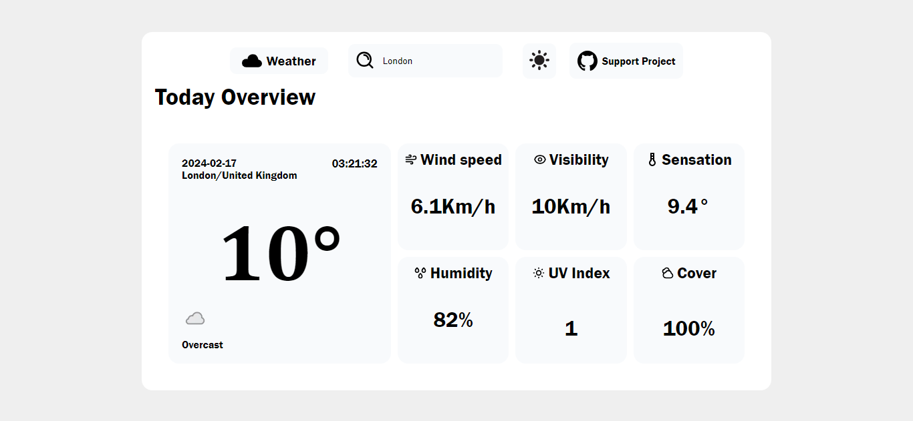

# Aplicación del Clima

¡Bienvenido a la aplicación del clima! Esta aplicación te permite obtener información sobre el clima actual de diferentes ciudades de todo el mundo.

## Portada de la Aplicación

## Uso

Para utilizar la aplicación, simplemente ingresa el nombre del país en inglés en el campo de búsqueda y presiona Enter o el botón de búsqueda. La aplicación buscará el clima actual para el país especificado y mostrará los resultados.

Por favor, ten en cuenta que la API utilizada solo acepta nombres de países en inglés. En algunos casos, la API puede devolver resultados de ciudades con el mismo nombre en lugar del país. Estamos trabajando para mejorar este aspecto y asegurarnos de que los resultados sean lo más precisos posible.

## Aplicación en Uso

## Tecnologías Utilizadas

- HTML5
- CSS3
- JavaScript (Vanilla)

## Mejoras Futuras

En el futuro, planeamos realizar las siguientes mejoras:

- Mejorar la interfaz de usuario para que sea más intuitiva y atractiva.
- Añadir nuevas funcionalidades, como la posibilidad de ver el pronóstico extendido, cambiar unidades de temperatura, etc.
- Optimizar el rendimiento de la aplicación para una experiencia más rápida y fluida.

## Notas Adicionales

Esta aplicación está construida utilizando únicamente HTML, CSS y JavaScript vanilla. No se utiliza ningún framework o biblioteca de JavaScript, y planeamos mantener este enfoque en el futuro.

¡Gracias por usar nuestra aplicación del clima!
